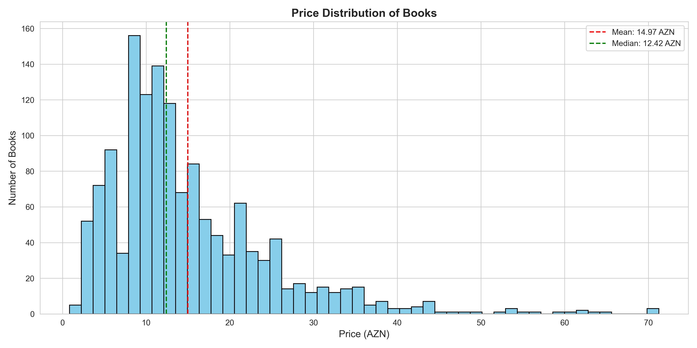
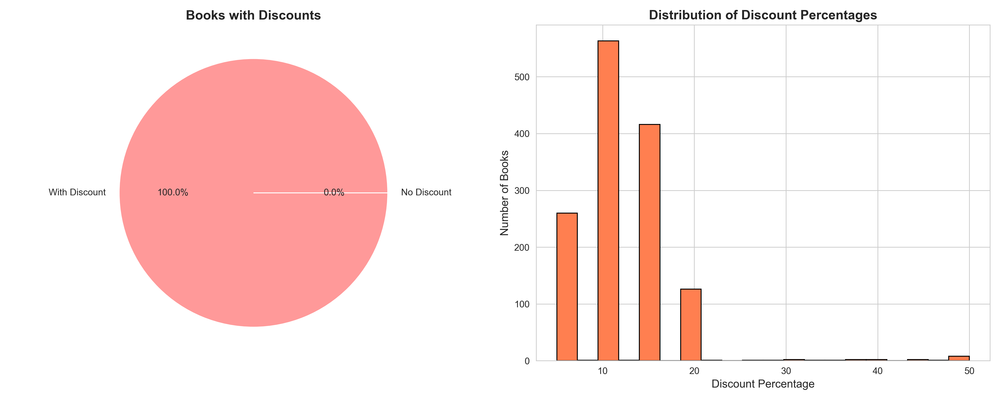
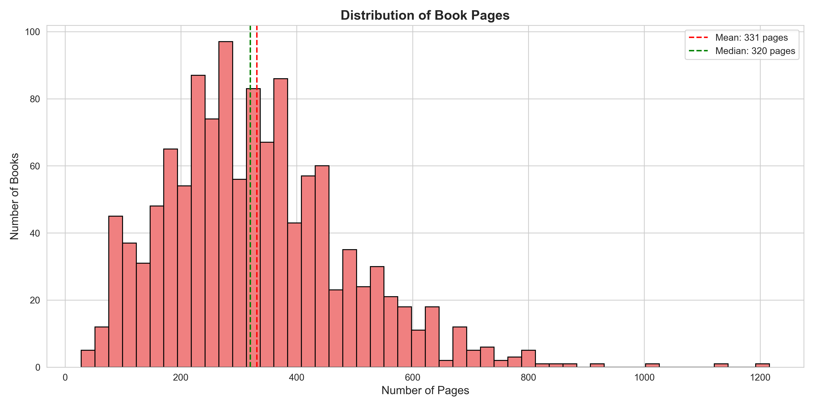
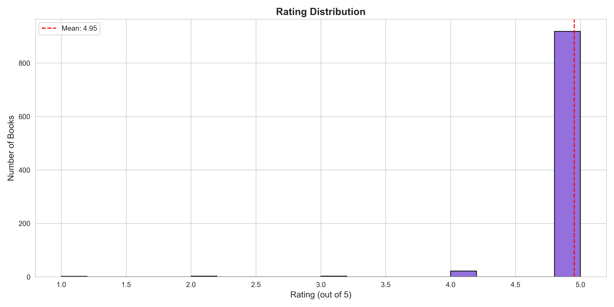
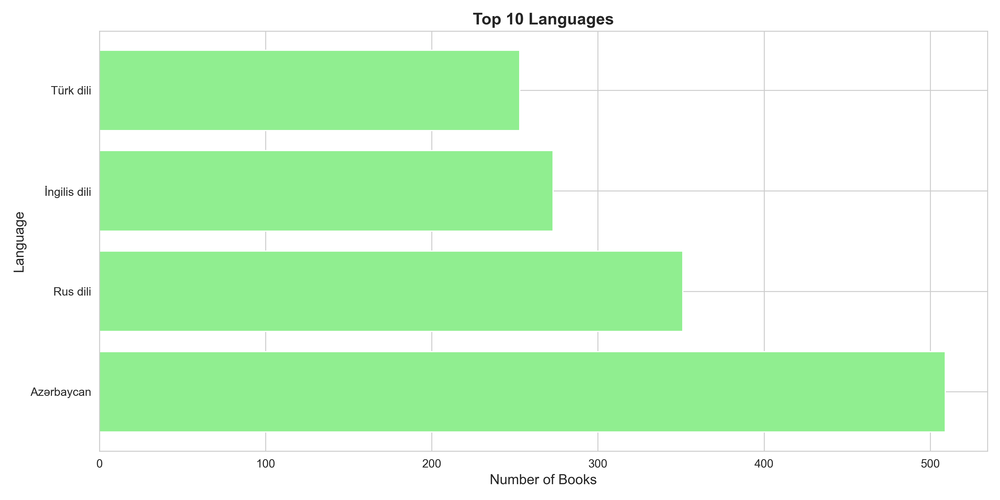
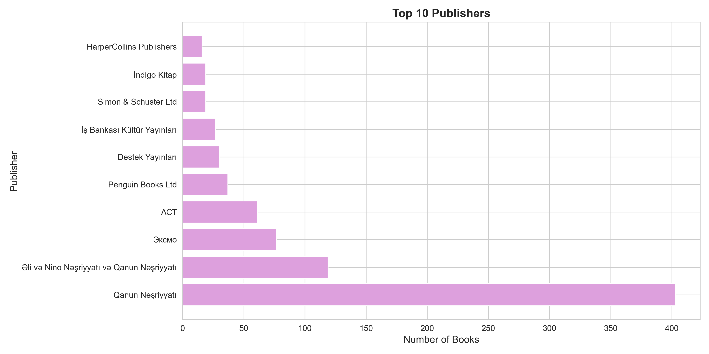
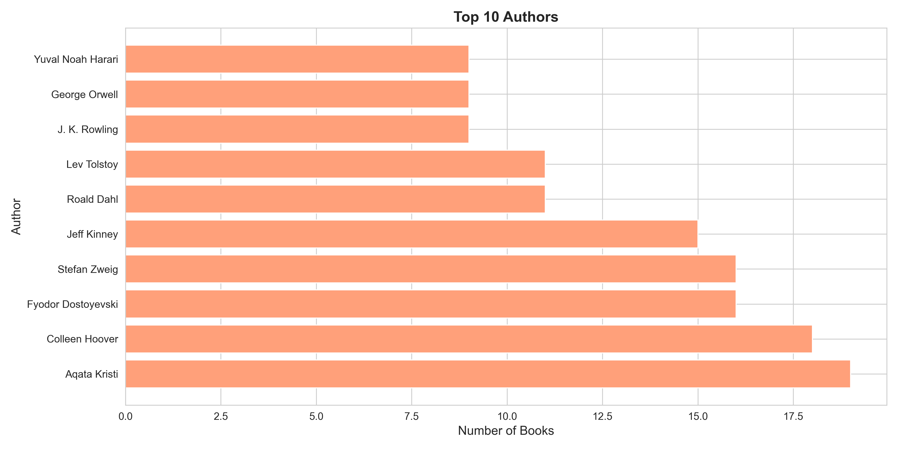
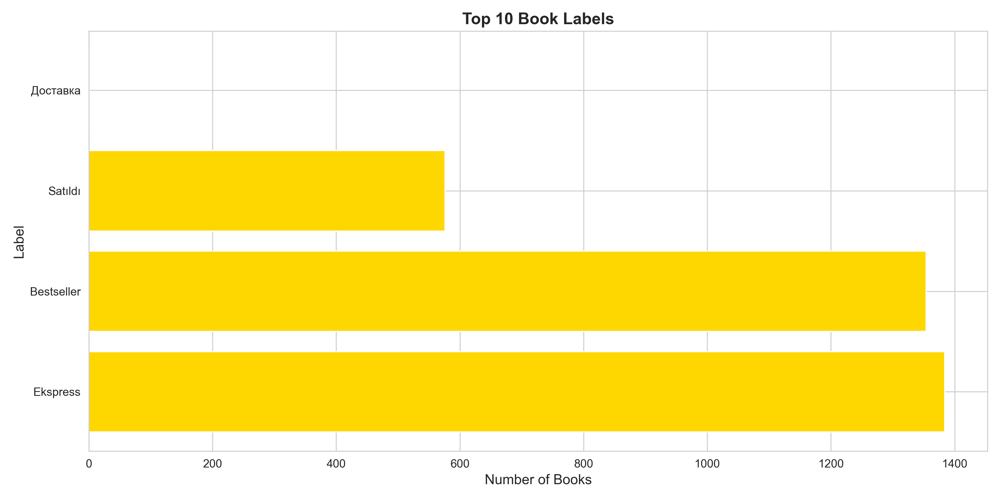
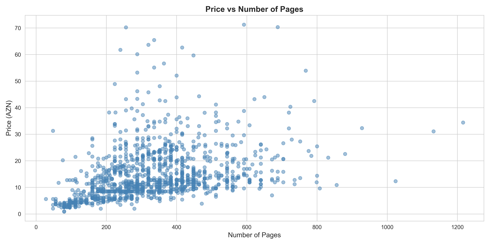
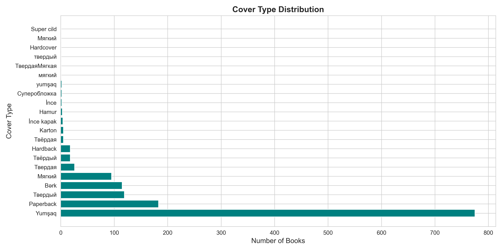

# Alinino.az Books Data Analysis

> Comprehensive analysis of 1,389 books from alinino.az bestsellers collection

## 📊 Executive Summary

This project scraped and analyzed the complete bestsellers collection from alinino.az, Azerbaijan's leading online bookstore. Using async web scraping and data visualization, we extracted insights about pricing, language preferences, popular publishers, and reading trends.

**Key Findings:**
- Average book price: **14.97 AZN** (median: 12.42 AZN)
- **100%** of books have active discounts (avg: 12%)
- **37%** of books are in Azerbaijani language
- Average book length: **331 pages**
- High customer satisfaction: **4.95/5** average rating

---

## 📈 Detailed Statistics

### 💰 Pricing Analysis

| Metric | Value |
|--------|-------|
| **Average Price** | 14.97 AZN |
| **Median Price** | 12.42 AZN |
| **Price Range** | 0.85 - 71.25 AZN |
| **Standard Deviation** | 9.81 AZN |

**Actionable Insights:**
- Most books are priced between 10-20 AZN, making them affordable for the mass market
- Premium books (>40 AZN) represent a small niche market
- The median being lower than the mean suggests some high-priced outliers



### 🏷️ Discount Strategy

| Metric | Value |
|--------|-------|
| **Books with Discount** | 1,389 (100%) |
| **Average Discount** | 12% |
| **Maximum Discount** | 50% |

**Actionable Insights:**
- Universal discount strategy suggests aggressive market penetration approach
- Most discounts cluster around 10-15%, creating consistent value perception
- High discount books (>30%) could be slow-moving inventory or promotional items



### 📚 Content Metrics

| Metric | Value |
|--------|-------|
| **Average Pages** | 331 |
| **Median Pages** | 320 |
| **Page Range** | 28 - 1,216 |

**Actionable Insights:**
- Most books are medium-length novels (250-400 pages)
- Short books (<100 pages) likely children's books or novellas
- Very long books (>800 pages) are classics or academic texts



### ⭐ Customer Satisfaction

| Metric | Value |
|--------|-------|
| **Books with Ratings** | 948 (68.2%) |
| **Average Rating** | 4.95/5 |
| **Median Rating** | 5.0/5 |

**Actionable Insights:**
- Extremely high ratings suggest strong curation or rating bias
- Nearly 70% engagement rate indicates active customer base
- Focus should be on converting non-reviewers to increase social proof



---

## 🌍 Market Analysis

### Language Distribution

| Language | Books | Percentage |
|----------|-------|------------|
| **Azərbaycan** | 509 | 37% |
| **Rus dili** | 351 | 25% |
| **İngilis dili** | 273 | 20% |
| **Türk dili** | 253 | 18% |

**Actionable Insights:**
- Strong local content (37% Azerbaijani) shows support for domestic literature
- Russian language maintains significant presence (legacy of Soviet era)
- Growing English language section (20%) indicates educated, cosmopolitan audience
- Turkish books popular due to cultural and linguistic proximity



### Top 10 Publishers

| Publisher | Books |
|-----------|-------|
| **Qanun Nəşriyyatı** | 403 |
| **Əli və Nino Nəşriyyatı və Qanun Nəşriyyatı** | 119 |
| **Эксмо** | 77 |
| **АСТ** | 61 |
| **Penguin Books Ltd** | 37 |
| **Destek Yayınları** | 30 |
| **İş Bankası Kültür Yayınları** | 27 |
| **Simon & Schuster Ltd** | 19 |
| **İndigo Kitap** | 19 |
| **HarperCollins Publishers** | 16 |

**Actionable Insights:**
- Qanun dominates with 29% market share - strong local publisher
- Russian publishers (Эксмо, АСТ) still significant in market
- International publishers (Penguin, HarperCollins) present but smaller footprint
- Opportunity to expand partnerships with mid-tier international publishers



### Top 10 Authors

| Author | Books |
|--------|-------|
| **Aqata Kristi** | 19 |
| **Colleen Hoover** | 18 |
| **Fyodor Dostoyevski** | 16 |
| **Stefan Zweig** | 16 |
| **Jeff Kinney** | 15 |
| **Roald Dahl** | 11 |
| **Lev Tolstoy** | 11 |
| **J. K. Rowling** | 9 |
| **George Orwell** | 9 |
| **Yuval Noah Harari** | 9 |

**Actionable Insights:**
- Agatha Christie dominates - classic mystery still popular
- Colleen Hoover (contemporary romance) shows modern reading tastes
- Strong presence of Russian classics (Dostoyevski, Tolstoy)
- Children's authors (Kinney, Dahl, Rowling) indicate family market
- Yuval Noah Harari signals demand for thought-provoking non-fiction



### Book Labels & Categories

| Label | Frequency |
|-------|-----------|
| **Ekspress** | 1,384 |
| **Bestseller** | 1,354 |
| **Satıldı** | 576 |

**Actionable Insights:**
- "Ekspress" (fast delivery) is key competitive advantage - nearly universal
- "Bestseller" label used extensively for social proof and marketing
- "Satıldı" (sold) on 41% of books shows strong sales velocity
- These labels drive urgency and purchase decisions



---

## 📊 Advanced Analytics

### Price vs. Pages Correlation

**Insight:** Weak positive correlation between page count and price. Most books cluster in the 200-400 page, 10-20 AZN range. Outliers are typically premium editions or specialty books.



### Cover Type Distribution

**Insight:** Understanding cover type preferences helps with inventory and printing decisions.



---

## 💡 Strategic Recommendations

### 1. Pricing Strategy
- **Maintain** the 10-20 AZN sweet spot for mass market appeal
- **Introduce** more budget options (<10 AZN) to capture price-sensitive customers
- **Premium segment** (40+ AZN) should focus on special editions and collections

### 2. Inventory Management
- **Prioritize** Azerbaijani and Russian language books (62% of market)
- **Expand** English language selection for growing educated demographic
- **Stock** proven authors (Christie, Hoover, classics) deeper

### 3. Marketing Initiatives
- **Leverage** "Ekspress" delivery as primary competitive advantage
- **Highlight** bestseller status more prominently in marketing
- **Create** urgency with "Satıldı" (sold) indicators
- **Target** promotions around 15% discount sweet spot

### 4. Customer Engagement
- **Incentivize** reviews for the 32% of books without ratings
- **Feature** high-rated books (4.95+ avg) in recommendations
- **Create** reading challenges around popular authors

### 5. Partnership Opportunities
- **Deepen** relationship with Qanun (largest publisher)
- **Expand** international publisher partnerships (currently underrepresented)
- **Explore** direct publishing for popular translated works

---

## 🛠️ Technical Implementation

### Data Collection
- **Method:** Asynchronous web scraping using aiohttp and asyncio
- **Pages Scraped:** 35 pages from bestsellers collection
- **Books Extracted:** 1,389 unique titles
- **Fields Captured:** 23 data points per book
- **Execution Time:** ~2 minutes (vs. ~6 hours with synchronous approach)

### Data Processing
- **Tools:** Pandas for data manipulation, Matplotlib & Seaborn for visualization
- **Charts Generated:** 10 professional visualizations
- **Statistics:** Comprehensive JSON and text reports

### Key Features
- Concurrent request handling (5 simultaneous connections)
- Batch processing (50 books per batch)
- Automatic timeout handling (30 seconds)
- Respectful scraping with rate limiting
- Error recovery and exception handling

---

## 📁 Project Structure

```
alinino_az/
├── scraper.py              # Async web scraper
├── analyze.py              # Data analysis & visualization
├── requirements.txt        # Python dependencies
├── alinino_books.csv       # Raw scraped data (1.7MB)
├── charts/                 # Generated visualizations
│   ├── 01_price_distribution.png
│   ├── 02_discount_analysis.png
│   ├── 03_language_distribution.png
│   ├── 04_top_publishers.png
│   ├── 05_top_authors.png
│   ├── 06_pages_distribution.png
│   ├── 07_labels_distribution.png
│   ├── 08_price_vs_pages.png
│   ├── 09_cover_type_distribution.png
│   ├── 10_rating_distribution.png
│   ├── statistics.json
│   └── statistics.txt
└── README.md              # This file
```

---

## 🚀 Usage

### Run the Scraper
```bash
# Install dependencies
pip install -r requirements.txt

# Run the async scraper (scrapes entire bestsellers collection)
python scraper.py
```

### Generate Analysis
```bash
# Analyze data and create visualizations
python analyze.py
```

---

## 📊 Data Fields

Each book record contains 23 fields:

| Field | Description |
|-------|-------------|
| `url` | Product page URL |
| `title` | Book title |
| `current_price` | Current price with currency |
| `current_price_numeric` | Price as float for analysis |
| `old_price` | Original price (if discounted) |
| `old_price_numeric` | Old price as float |
| `discount_percent` | Discount percentage text |
| `discount_numeric` | Discount as number |
| `isbn` | ISBN/SKU identifier |
| `publisher` | Publishing house |
| `author` | Book author(s) |
| `pages` | Page count text |
| `pages_numeric` | Pages as number |
| `language` | Book language |
| `cover_type` | Hardcover/Softcover |
| `description` | Book description |
| `rating` | Customer rating text |
| `rating_numeric` | Rating as float (0-5) |
| `reviews_count` | Number of reviews |
| `availability` | Stock status |
| `labels` | Tags (Bestseller, Express, etc.) |
| `categories` | Book categories/genres |
| `image_url` | Product image URL |

---

## 📝 License & Attribution

This project is for educational and analytical purposes. All data belongs to alinino.az.

**Scraping Ethics:**
- Respectful rate limiting (1-second delays)
- Limited concurrent connections (5 max)
- User-agent identification
- No server overload

---

## 🔄 Future Enhancements

- [ ] Track price changes over time
- [ ] Sentiment analysis of book descriptions
- [ ] Category/genre deep-dive analysis
- [ ] Competitive pricing analysis vs other retailers
- [ ] Recommendation engine based on purchase patterns
- [ ] Seasonal trend analysis
- [ ] Author network visualization

---

## 📧 Contact

For questions or collaboration opportunities, please open an issue in this repository.

---

**Last Updated:** November 23, 2025
**Data Snapshot:** 1,389 books from alinino.az bestsellers collection
